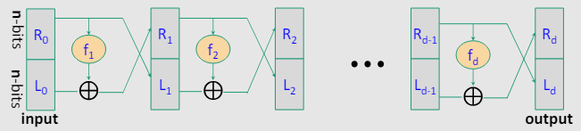
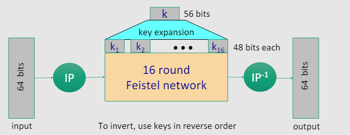
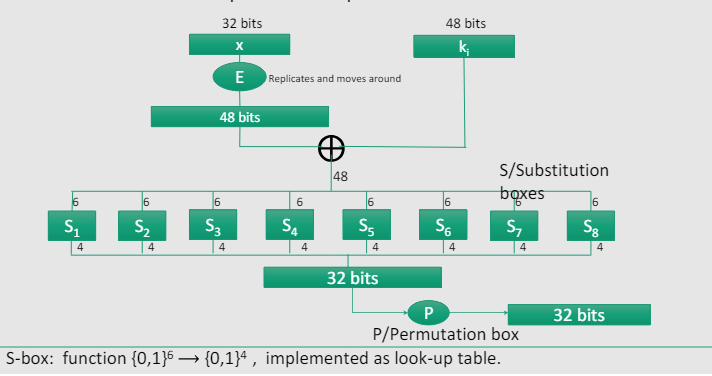
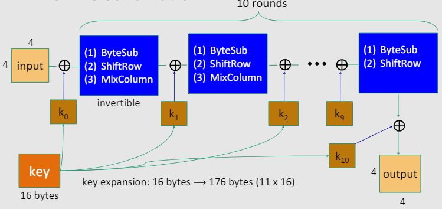

## Block Ciphers
Si parla di cifrari a blocchi quando il messaggio in chiaro è diviso in blocchi di lunghezza fissa e ogni blocco è cifrato separatamente.
Iterazioni di un cifrario a blocchi:
- la chiave *k* è usata per generare una sequenza di sottochiavi *k_1, k_2, ..., k_n*.
- il messaggio in chiaro *m* è diviso in blocchi *m_1, m_2, ..., m_n*.
- $R(k_i, m_i$) è una funzione di round
- $c = E(k, m) = R(k_n, R(k_n-1, ..., R(k_1, m)))$

Confronto di performance:
- Stream Ciphers:
    - RC4: 126 Mbit/s
    - Salsa20: 643 Mbit/s
    - Sosemanuk: 727 Mbit/s
- Block Ciphers:
    - 3DES: 13 Mbit/s
    - AES-128: 109 Mbit/s

**PRF(Pseudo-Random Function):**$\newline$
$F: K \times X -> Y$ è una funzione se esiste un algoritmo efficiente che calcola $F(k, x)$ per ogni $k \in K$ e $x \in X$.

**PRP(Pseudo-Random Permutation):**$\newline$
$E: K \times X -> X$ è una permutazione se esiste un algoritmo deterministico efficiente che calcola $E(k, x)$, $E(k, .)$ è 1 a 1 per ogni $k \in K$ e esiste un algoritmo efficiente che invertendo $E(k, x)$ calcola $D(k, y)$ per ogni $k \in K$ e $y \in X$.

In sostanza ogni PRP è una PRF dove X = Y ed è efficiente invertire E.

**PRF sicura:**$\newline$
Un PRF è sicura se è indistinguibile da una funzione random.

$F: K \times X -> Y$ è una PRF.

$Funs[X, Y] = {f: X -> Y}$ è l'insieme delle funzioni(di tutte le funzioni esistenti generali) da X a Y, di grandezza $|Funs[X, Y]| = |Y|^{|X|}$(ogni elemento di X ha |Y| possibili valori).

$S_f = {F(k, .) : k \in K}$ è l'insieme delle funzioni generate da F utilizzando ogni chiave(queste funzioni utilizzano una chiave per mappare X in Y) ed è $\subset Funs[X, Y]$, di grandezza $|S_f| = |K|$(ogni chiave genera una funzione).

Una PRF è sicura se una funzione randomica di $Funs[X, Y]$ è indistinguibile da una funzione randomica di $S_f$.

*Definizione:*
Consideriamo una PRF $F: K \times X -> Y$. Per $b = 0, 1$ definiamo l'esperimento $EXP(b)$ come:
- $b=0$: k scelto uniformemente da K, A riceve $F(k, .$) e restituisce $b'$(il challenger sceglie una chiave e dà ad A la funzione generata da quella chiave)
- $b=1$: f scelta uniformemente da $Funs[X, Y]$, A riceve f e restituisce $b'$(il challenger sceglie una funzione randomica e dà ad A quella funzione)
- A manda delle query $x_1, x_2, ..., x_q$
- Challenger f ritorna $f(x_1), f(x_2), ..., f(x_q)$
- A restituisce $b'$(A deve indovinare se ha ricevuto una funzione randomica o una generata da una chiave)

$Adv_{PRF}[A, F] = |Pr[EXP(0) = 1] - Pr[EXP(1) = 1]|$ è il vantaggio di A su F.
F è sicura se il vantaggio di A è trascurabile.

**PRP sicura:**$\newline$
Un PRP è sicura se è indistinguibile da una permutazione randomica.

$E: K \times X -> X$ è una PRP.

$Perms[X] = {f: X -> X}$ è l'insieme delle permutazioni di X, di grandezza $|Perms[X]| = |X|!$(ogni elemento di X ha |X| possibili posizioni).

$S_e = {E(k, .) : k \in K}$ è l'insieme delle permutazioni generate da E utilizzando ogni chiave(queste permutazioni utilizzano una chiave per mappare X in X) ed è $\subset Perms[X]$, di grandezza $|S_e| = |K|$(ogni chiave genera una permutazione).

*Definizione:*
Consideriamo una PRP $E: K \times X -> X$. Per $b = 0, 1$ definiamo l'esperimento $EXP(b)$ come:
- $b=0$: k scelto uniformemente da K, A riceve $E(k, .)$ e restituisce $b'$(il challenger sceglie una chiave e dà ad A la funzione generata da quella chiave)
- $b=1$: f scelta uniformemente da $Perms[X]$, A riceve f e restituisce $b'$(il challenger sceglie una permutazione randomica e dà ad A quella permutazione)
- A manda delle query $x_1, x_2, ..., x_q$
- Challenger f ritorna $f(x_1), f(x_2), ..., f(x_q)$
- A restituisce b'(A deve indovinare se ha ricevuto una permutazione randomica o una generata da una chiave)

$Adv_{PRP}[A, E] = |Pr[EXP(0) = 1] - Pr[EXP(1) = 1]|$ è il vantaggio di A su E.
E è sicura se il vantaggio di A è trascurabile.

### Data Encryption Standard(DES)
**Feistel Network:**$\newline$
$\forall (\text{ arbitrarie }) f_1, f_2, ..., f_d: \{0, 1\}^n -> \{0, 1\}^n$ non per forza invertibili, Feistel Netwrok $F: \{0, 1\}^{2n} -> \{0, 1\}^{2n}$ è invertibile.
- input: n-bits in $R_0$ e $L_0$
- $R_i = f_i(R_{i-1}) \oplus L_{i-1}$
- $L_i = R_{i-1}$
- output: $R_d, L_d$

*Dimostrazione:*
Facciamo il procedimento inverso(da destra a sinistra), applicando $f_1, f_2, ..., f_d$ in ordine inverso.
- $R_{i-1} = L_i$
- $L_{i-1} = f_i(R_{i-1}) \oplus L_i$

**Esempio:**$\newline$
DES: 16 round, 56-bit key, 64-bit block

- l'input viene mescolato con una permutazione iniziale(IP)
- 16 round di Feistel Network: in ogni round si utilizza una sottochiave di 48-bit che si combina a metà dell'output del round precedente, si applica una funzione invertibile e si scambia i due blocchi
- l'output viene passatto attraverso una permutazione inversa(IP^-1)

La funzione invertibile $f_i(x) = F(k_i, x)$ è composta da:

- espansione di x: 32-bit -> 48-bit
- XOR con la chiave k_i di 48-bit
- 8 S-boxes: 6-bit -> 4-bit, S-boxes sono delle funzioni non invertibili $S_i: \{0, 1\}^6 -> \{0, 1\}^4$ implementate con delle tabelle(le colonne rappresentano i 4-bit in mezzo, le righe rappresentano i 2-bit esterni, il valore in una cella è il valore di output)
- output: 32-bit
- permutazione dei 32-bit attraverso una tabella di permutazione

Se venissero scelte a random le S-box e le P-box avremmo un cifrario a blocchi insicuro.

**Ricerca esaustiva della chiave:**$\newline$
Date delle coppie input/output $(m_i, c_i = E(k, m_i))$ possiamo trovare la chiave k.

*Lemma:*$\newline$
Supponiamo che DES sia un cifrario ideale($2^{56}$(dato che una chiave ha 56 bits, quindi hai tutte le permutazioni di questi 56 bits) funzioni randomiche invertibili $\Pi_1, \Pi_2, ..., \Pi_{2^{56}} : \{0, 1\}^{64} -> \{0, 1\}^{64}$)(quindi si deve comportare come una funzione pseudocasuale).
Allora $\forall m, c: \exists \text{ al massimo 1 }  k: c = DES(k, m)$ con probabilità $>= 1 - \frac{1}{256}\approx 99.5%$.

*Dimostrazione:*$\newline$
$Pr[\exists k' \neq k: c = DES(k,m) = DES(k',m)] <= \sum_{k' \in {0,1}^{56}} Pr[DES(k,m) = DES(k',m)] <= 2^{56} * \frac{1}{2^{64}} = \frac{1}{256}$(ci sono $2^{56}$ chiavi possibili e $2^{64}$ possibili output per ogni chiave, quindi la possibilità che due chiavi diverse generino lo stesso output è $\frac{1}{256}$).

- Per due coppie DES $(m_1, c_1 = DES(k, m_1))$ e $(m_2, c_2 = DES(k, m_2))$ possiamo trovare la chiave k con probabilità $\approx 1 - \frac{1}{2^{71}}$.
- Per AES-128 la probabilità è $\approx 1 - \frac{1}{2^{128}}$.

### Attacchi di ricerca esaustiva
**DES Challenge:**$\newline$
Dato un messaggio in chiaro diviso in blocchi di 8 bytes, criptati con la stessa chiave DES, trovare la chiave.
Trovare $k \in \{0, 1\}^{56}$ tale che $DES(k, m_i) = c_i \forall i \in {1, 2, 3}$ e decripta $c_4, c_5, etc$.

**Migliorare DES contro la ricerca esaustiva:**
- 3DES: 
    - $3E: K^3 \times M -> M \rightarrow 3E(k_1, k_2, k_3, m) = E(k_1, D(k_2, E(k_3, m)))$
    - lunghezza chiave: 3 * 56 = 168 bits
    - 3 volte più lento del DES(se k1 = k2 = k3, allora è uguale a DES)
    - attacco semplice in tempo $\approx 2^{118}$
- DESX:
    - $EX: K \times M -> M \rightarrow EX(k_1, k_2, k_3, m) = k_1 \oplus E(k_2, m \oplus k_3)$
    - lunghezza chiave: 64 + 56(k_2) + 64 = 184 bits
    - attacco semplice in tempo $\approx 2^{64 + 56} = 2^{120}$

*Perchè non si utilizza il 2DES?*$\newline$
$2E: K^2 \times M -> M \rightarrow 2E(k_1, k_2, m) = E(k_1, E(k_2, m))$

*Attacco meet-in-the-middle:*$\newline$
Dato m e c:
- trovare $(k_1, k_2)$ tale che $E(k_1, E(k_2, m)) = c$ o equivalentemente
- trovare $(k_1, k_2)$ tale che $E(k_2, m) = D(k_1, c)$

Step 1:
- per ogni $k_i \in \{0, 1\}^{56}$ calcola $E(k_i, m)$ e memorizza $(k_i, E(k_i, m))$ in una tabella ordinata per $E(k_i, m)$

Step 2:
- per ogni $k_i \in \{0, 1\}^{56}$ guarda se $D(k_i, c)$ è nella seconda colonna della tabella(quindi guarda se decifrando il messaggio con ogni chiave trova una corrispondenza tra il messaggio cifrato nella tabella e il messaggio che ha decifrato, se la trova ha le due chiavi)
- se sì, $E(k_j, m) = D(k_i, c)$, quindi $(k_i, k_j) = (k_2, k_1)$

Il tempo è $\approx 2^{56}log(2^{56}) + 2^{56}log(2^{56}) < 2^{63} << 2^{112}$.
Nella 3DES il tempo è $\approx 2^{56}log(2^{56}) + 2^{112}log(2^{56}) < 2^{118}$(build+sort nella tabella + ricerca binaria nella tabella).

### Altri attacchi sui cifrari a blocchi
**Attacco lineare:**$\newline$
Se c'è linearità in S-boxes, l'attacco ci impiega $2^{43}$.

**Attacco quantistico:**$\newline$
Problema di ricerca generico:
- data $f: X -> \{0, 1\}$, trovare x tale che f(x) = 1.
- classico: $\approx O(|X|)$
- quantistico: $\approx O(\sqrt{|X|})$

*Ricerca esaustiva quantistica:*
- dati $m$ e $c=E(k, m)$
- $\forall k \in K, f(k) = 1$ se $E(k, m) = c$, altrimenti $f(k) = 0$
- algoritmo di Grover: $\approx O(\sqrt{|K|})$

### Advanced Encryption Standard(AES)

- non è basato su Feistel Network(lavora in parallelo su tutto l'input)
- è un cifrario a blocchi che funziona iterativamente:
    - block size: 128-bit
    - key size: $128(3.4*10^{38} \text{ chiavi possibili }), 192(6.2*10^{57} \text{ chiavi possibili }), 256(1.1*10^{77} \text{ chiavi possibili })$ bits
    - 10, 12, 14 round
    - key scheduling: 44, 52, 60 sottochiavi di 32-bit(come sempre la chiave è divisa tra i vari round)
- ad ogni round(a parte l'ultimo che si fanno solo ByteSub e ShiftRow) si applicano 4 funzioni:
    - SubBytes: sostituzione di ogni byte con un altro byte utilizzando una S-box
    - ShiftRows: una permutazione che ciclicamente shifta le ultime 3 righe nello Stato
    - MixColumns: sostituzione ch eutilizza Galois Fields, GF(2^8)
    - AddRoundKey: XOR con una chiave espansa(questa operazione è invertibile quindi si può fare sia in cifratura che in decifratura e utilizza la chiave del round corrente)

**Attacchi su AES:**$\newline$
- recupero della chiave: 4 volte migliore della ricerca esaustiva(BKR'11)
- attacchi relativi a chiavi AES-256: dati $2^{99}$ plaintext/ciphertext dati da 4 chiavi AES-256, si può recuperare la chiave con probabilità $\approx 2^{99}$(BK'09)