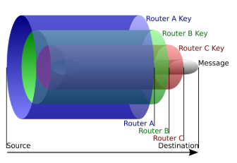
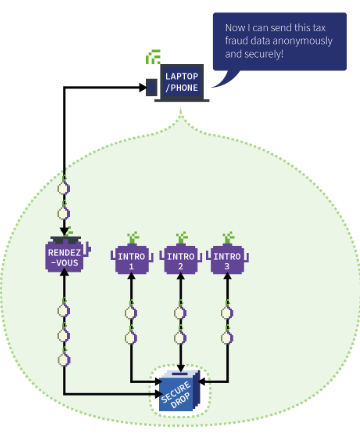

### Networl Security: Definitions, Internet security and Anonymity

#### Principi di sicurezza
la sicurezza informatica si basa su due principi fondamentali:
- AAA:
    - *Authentication:* capacità di un sistema di garantire che un utente possa essere identificato tramite informazioni in suo possesso(quello che si ha: badge, quello che si sa: password, quello che si è: biometrici). Possiamo combinare più metodi per un autenticazione multi-fattore, quindi più sicura(più meccanismi dello stesso tipo non aumentano la sicurezza).
    - *Authorization:* specifica i diritti di accesso di un utente, ovvero cosa può fare e cosa non può fare.
    - *Accounting:* tracciamento delle attività di un utente, ovvero cosa ha fatto e quando.
    - Questi tre principi dipendono l'uno dall'altro.
- CIA:
    - *Confidentiality:* garantisce che le informazioni siano accessibili solo a chi è autorizzato.
        - Attacchi:
            - *Man in the middle:* un attaccante si interpone tra due comunicanti per modificare i messaggi(fingendosi mittente o destinatario).
            - *Eavesdropping:* un attaccante ascolta la comunicazione tra due comunicanti.
    - *Integrity:* garantisce che le informazioni non siano state modificate durante la trasmissione(si è sicuri del mittente e del contenuto).
        - Attacchi:
            - *Manipulation:* un attaccante modifica i messaggi durante la trasmissione.
            - *User Impersonation/Spoofing:* un attaccante si finge un'altra persona.
    - *Availability:* garantisce che le informazioni siano disponibili quando necessario.
        - Attacchi:
            - *Denial of Service(DoS):* un attaccante nel mezzo elimina o modifica i messaggi.
            - *Denial of Service(Dos):* un attaccante sovraccarica il sistema con richieste inutili.
            - *Denial of Service + Spoofing:* l'attaccato non si fida di richieste inutili, quindi l'attaccante si finge una persona diversa ogni volta per fare richieste inutili.
            - *Distributed Denial of Service(DDoS):* l'attaccante viene riconosciuto e bloccato, quindi si serve di più macchine per fare richieste inutili.
    - Questi tre principi sono indipendenti l'uno dall'altro.

**Anonimato:** Questa proprietà non è èresente in *CIA*, perchè non rappresenta la sicurezza di un sistema, ma una maniera per eludere l'accounting. 

Quando navighiamo online non siamo anonimi, siamo soggetti a profilazione da parte di ISP(Internet Service Provider), social network, tracker cookies, etc. 

**IPv4:** $\newline$
Indirizzo IP a 32 bit, serve per identificare univocamente un host in una rete.
- Attacchi:
    - *IP Spoofing:* gli IP non sono protetti da integrità(ossia non si può garantire che un IP sia quello che dice di essere), chiunque può cambiare il proprio IP sorgente per fare attacchi.

**Routing:** Un pacchetto in rete viene instradato da un router all'altro, che per definizione sono dei *Man in the middle*.

**TCP:** $\newline$
A livello di trasporto, i servizi vengono identificati da una porta, che è un numero a 16 bit. Prevede un handshake a 3 vie per stabilire una connessione(3 pacchetti: SYN, SYN-ACK, ACK).
- Attacchi:
    - *SYN Flooding:* un attaccante invia un SYN al server, che risponde con un SYN-ACK, ma l'attaccante non risponde con un ACK, quindi il server tiene aperta la connessione per un numero finito di connessioni(che può essere sfruttato per fare un DoS).
    - *Sniffing:* un attaccante ascolta la comunicazione tra due comunicanti.

**DNS:** $\newline$
Il Domain Name System è un sistema di risoluzione dei nomi a indirizzi IP(altrimenti bisognerebbe ricordare tutti gli indirizzi IP). 
- Attacchi:
    - *Typosquatting:* un attaccante registra un dominio simile a quello originale per rubare informazioni.
    - *Sniffing:* un attaccante ascolta le richieste DNS per rubare informazioni.

*Esempio:* Wireshark è un software di sniffing che permette di vedere tutti i pacchetti che passano in una rete.

#### Anonimizzazione
**Anonimous Remailers:** $\newline$
Permette di inviare email in modo anonimo, in quanto il mittente non è visibile.

E' il concetto alla base di un *VPN*, che permette di nascondere il proprio IP dietro un IP di un server VPN.

Un anonimous remailer è un esempio di *Proxy*, che permette di nascondere il proprio IP dietro un IP di un server proxy. Il problema è che il proxy può vedere tutto il traffico(può agire da eavesdropper).

**Mix-based Anonymity:** $\newline$
Utilizza *relay servers*(ossia server che inoltrano i pacchetti) per nascondere il mittente e il destinatario. 
E' un tipo di relay che:
- raccoglie pacchetti di lunghezza fissa da mittenti diversi.
- accumula n pacchetti in un batch.
- cripta i pacchetti.
- invia i pacchetti in un ordine casuale.

Un *Mix* ha una chiave pubblica con cui i mittenti possono criptare i pacchetti.

*Svantaggi:*
- alta latenza
- criptaggio a chiave pubblica è lento

*Come diminuire la latenza?* $\newline$
- Utilizzare crittografi a chiave pubblica per stabilire un circuito di comunicazione con chiavi simmetriche per ogni nodo.
- Decriptaggio simmetrico e ricriptaggio per ogni nodo.
- Ogni nodo funziona come un Mix, quindi anche se un nodo è compromesso, non si può risalire al mittente.

**Onion Routing:** $\newline$
Utilizzato da *Tor*, è un sistema di anonimizzazione che permette di nascondere il mittente e il destinatario.

*Funzionamento:*
1. Il client di un utente ottiene una lista di nodi Tor da un directory server.
2. Il client sceglie un percorso casuale di nodi, I percorsi *verdi* sono criptati, mentre i percorsi *rossi* sono in chiaro.
3. Se l'utente visita un altro sito, il percorso cambia.

*Tor encryption:* $\newline$

**Overlay Network:** $\newline$
Tor è un esempio di overlay network, ossia una rete chiusa al quale interno vengono distribuiti dati in modo anonimo.
Esiston servizi di Tor che permettono di farvi uscire sulla rete pubblica(Exit Node). I detentori di questi nodi possono vedere il traffico in chiaro, ed essendo pubblici vengono spesso bloccati da certi servizi.

**Tor Onion Service:** $\newline$
Un *Onion Service*(SecureDrop) è un servizio che si nasconde e protegge dietro la rete Tor.
- Permette l'accesso attraverso 3 *Introduction Points* che sono connessi tra loro tramite un circuito di comunicazione.
- Questi Introduction Points e una chiave pubblica, tutti firmati con la chiave privata del servizio, si trovano in una directory server.
- Un client che vuole accedere al servizio, chiede la chiave pubblica al directory server.
- Utilizzi la chiave incorporata nell'indirizzo e la firma per verificare quello che hai ricevuto, per fidarsi degli Introduction Points ricevuti.
- Si decide un *rendezvous point* neutrale, dove il client e il servizio si incontrano per stabilire una connessione.
- Si chiede un introduzione al servizio, da un Introduction Point, che permette di stabilire una connessione con il servizio.
- L'Introduction Point invia i tuoi dettagli al servizio, che se decide se accettare la connessione(se sei affidabile).
- Il *rendezvous point* verifica che le stringhe tua e del servizio corrispondano, e se si, stabilisce una connessione tra te e il servizio.
- Attraverso il *rendezvous point* si stabilisce una connessione tra te e il servizio.

**Parte brutta di Tor:** $\newline$
Tor è stato creato per proteggere la privacy, ma viene utilizzato per fare attività illegali.

- *Data Leaks:* rilascio di informazioni sensibili.
- *Data Leak:Fullz:* rilascio di informazioni personali minime per creare conti bancari falsi.
- *Password Leak:* rilascio di password.

Esistono servizi esterni(Have I Been Pwned) che permettono di verificare se le proprie informazioni sono state rilasciate, o altri servizi software che permettono di candagliare la rete alla ricerca di leak.

**Leak di anonimato:** $\newline$
- *Geolocation:* un attaccante può scoprire la posizione di un utente.
- *DNS:* una richiesta DNS può rivelare a cosa stai accedendo(per esempio: accedi ad un sito da un account Unibo, una richiest DNS per richiedere il sito può essere inviata fuori da Tor e quindi rivelare quello che stai facendo).
- *Side Channel:* un attaccante può scoprire informazioni attraverso un canale secondario(se tenete sempre il browser in finestra di dimensioni fisse, un attaccante può scoprire che siete voi attraverso la dimensione della finestra).

**Least Privilege:** $\newline$
Un utente dovrebbe avere solo i permessi necessari per fare quello che deve fare. Non rilasciare più informazioni di quelle necessarie.

- *Tor Browser:* è un browser che permette di navigare in modo anonimo.
- *Tails:* è un sistema operativo che permette di navigare in modo anonimo.

