## Internet security: IPsec and TLS
### IPsec
Non ci si fida nella sicurezza end-to-end delle applicazioni, quindi si vuole garantire la sicurezza a livello di rete. L'obiettivo è facilitare la connessione diretta tra IP attraverso anche reti non fidate.

IPsec garantisce:
- controllo di accesso
- integrità
- autenticazione dell'origine dei dati
- confidenzialità
- rigetto di pacchetti replayed

*Sviluppo di IPsec:*
- *Transport mode:* incapsula un protocollo di livello superiore(UDP, TCP) e aggiunge un header IP in chiaro.
- *Tunnel mode:* incapsula un pacchetto IP in un nuovo pacchetto IP con un nuovo header IPsec.

*Sicurezza di IPsec:*
- *Authentication Header(AH):* garantisce l'integrità e l'autenticazione senza confidenzialità.
- *Encapsulating Security Payload(ESP):* garantisce confidenzialità, integrità e autenticazione.

*Security Associations(SA):*
Relazione tra mittente e ricevente, composta da 3 parametri:
- Security Parameter Index(SPI):
    - sequence number counter: per generare una sequenza di numeri nell'header
    - sequence counter overflow: previene la trasmissione di altri pacchietti nel SA
    - anti-replay window: per vedere se un pacchetto in arrivo è già stato ricevuto
    - AH information: authentication algorithm, key, key lifetime
    - ESP information: encryption algorithm, key, key lifetime, initial values
    - lifetime: durata dell'associazione
    - protocol mode: tunnel o transport
- IP Destination Adress
- Security Protocol Identifier(ESP o AH)

SPI e IP Destination Adress identificano univocamente u particolare SA. Gli SA sono unidirezionali, il mittente fornisce i dati al ricevente.

**Transport mode:**
- ESP: cripta e autentica i dati(IP payload), ma non l'header IP.
- AH: autentica l'header IP e i dati, ma non li cripta.

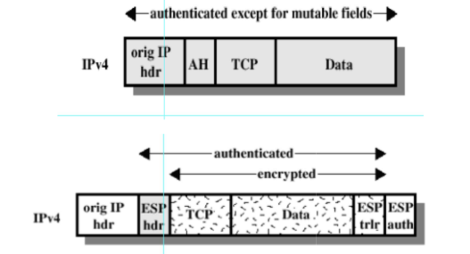

**Tunnel mode:**
- ESP: cripta e autentica l'intero pacchetto IP interno.
- AH: autentica l'intero pacchetto IP interno e l'header IP esterno.

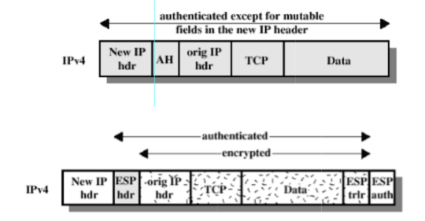

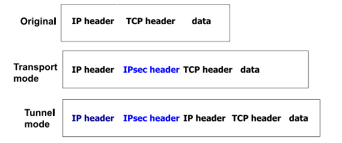

**IPsec headers:**
- AH:
    - protegge integrità dell'header IP e dei dati
    - fornisce autenticazione dei dati di origine
    - protezione contro replay
- ESP:
    - protegge confidenzialità e integrità dei dati(ma non dell'header IP)
    - autenticazione dei dati di origine
    - protezione contro replay

**Authentication Header(AH):**
Fornisce supporto per l'autenticazione e l'integrità dei pacchetti IP, utilizzando HMAC basato su MD5 o SHA-1

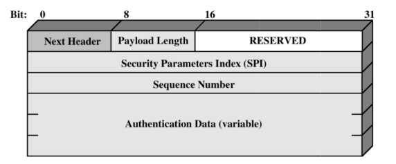

*Prevenzione di replay:*
Quando una SA è stabilita, il mittente inizializza il sequence counter a 0. Ogni pacchetto inviato incrementa il sequence counter e viene inviato con il sequence number nell'header. Il ricevente mantiene un anti-replay window per evitare che pacchetti duplicati vengano accettati.

**Encapsulating Security Payload(ESP):**
Fornisce supporto per la confidenzialità, l'integrità e l'autenticazione dei pacchetti IP. Utilizza algoritmi di crittografia tipo 3DES, Blowfish, IDEA, CAST, 3IDEA.

**IPsec Key Management:**
Goal: distribuire le chiavi tra gli host comunicante e setuppare le SA.
- *Manual key:* l'amministratore di sistema configura le chiavi degli host
- *Automated key management:* Oakley Key Determination Protocol, Internet Security Association and Key Management Protocol(ISAKMP), Internet Key Exchange(IKE)

Perchè non si utilizza sempre IPsec?
- difficile
- interazione con NAT(come fa NAT a instradare i pacchetti se l'header è criptato?)
- è più facile usare sicurezza a livello di applicazione

**Internet Key Exchange(IKE):**
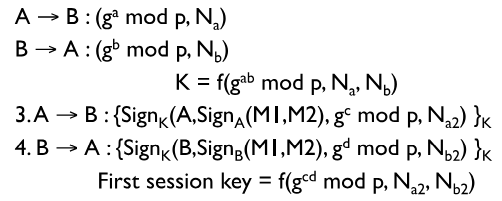

Le sessioni IKE sono nello spazio dell'utente, utilizzano UDP. 

### VPN
Una VPN è una rete virtuale costruita su una rete esistente fisica che fornisce un collegamento sicuro:
- protezione di dati, confidenzialità, integrità, autenticazione
- origine dei dati autenticata
- protezione contro replay
- controllo di accesso

Le VPN si usano per proteggere le comunicazioni effettuate su reti pubbliche(tipo Internet). La modalità più comune per implementare una VPN è IPsec.

**Modelli di architettura VPN:**
- *Gateway-to-Gateway:* connessione protetta tra due reti specifiche(esempio: rete principale aziendale e rete di una filiale)
- *Host-to-Gateway:* connessione protetta tra host e rete
- *Host-to-Host:* connessione protetta tra due specifici computer(host)

**Raccomandazioni NIST per VPN:**
NIST(National Institute of Standards and Technology) ha creato delle linee guida su come implementare una VPN:
- se un informazione che attraversa un VPN deve non essere vista da un utente non della VPN deve essere criptata
- deve utilizzare un FIPS-approved algoritmo di criptaggio
- deve garantire protezione d'integrità
- deve utilizzare un FIPS-approved algoritmo di protezione d'integrità
- deve garantire protezione contro replay
- IKE SA deve avere un lifetime non più lungo di 24h e IPsec SA non più di 8h
- IKE SA deve ricreare le chiavi dopo 24h
- Il gruppo Diffie-Hellman deve stabilire le chiavi per IKE e IPsec
- più grande è il gruppo DH più sarà lungo il processo

### TLS
TLS(Transport Layer Security) è un protocollo di sicurezza che fornisce canali end-to-end sicuri, fornisce: integrità(computando MAC e inviandolo col messaggio), autenticazione, confidenzialità(data dal criptaggio).
Definisce le caratteristiche del canale: key establishment, encryption cipher, authentication mechanism.
Lo scmabio di chiave utilizza un criptaggio a chiave pubblica.
Richiede un protocollo end-to-end affidabile, infatti funziona sopra TCP.

**TLS vs IPsec:**
- i goal di sicurezza sono simili
- IPsec è più flessibile sui servizi che offre
- differenza in granularità: IPsec opera a livello di rete tra due host, TLS opera a livello di applicazione tra due processi

**Architettura TLS:**
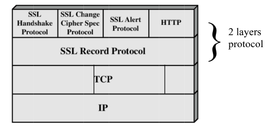

**Sessione e Connessione:**
- *Sessione:* 
    - un'associazione tra client e server
    - creata con un Handshake Protocol
    - definisce parametri crittografici sicuri
    - comprende:
        - session identifier
        - peer certificate
        - compression method(per comprimere i dati prima del criptaggio)
        - cipher sec(algoritmo di criptaggio e hash)
        - master secret(48 byte segreti scambiati tra client e server)
        - is resumable(indica se la sessione può essere riutilizzata)
- *Connessione:* 
    - end-to-end connection sicura
    - ogni connessione è associata ad una sessione
    - funziona così:
        - client e server randomici scelti per la connessione
        - il server scrive il segreto MAC(la chiave comune è usata per computare il MAC sui dati e spedirlo)
        - il client scrive il segreto MAC
        - il server scrive la chiave(che è usata per criptare i dati)
        - il client scrive la chiave
        - IV(Initialization Vector) è usato per inizializzare l'algoritmo di criptaggio
        - sequence number è usato per evitare replay

**SSL Record Protocol:**
Utilizza chiavi condivise create con l'Handshake Protocol per criptare i dati, fornendo così confidenzialità e integrità.
Processo:
- frammenta i dati in blocchi
- comprime i blocchi
- aggiunge MAC
- cripta i blocchi
- aggiunge SSL Record Header

**Alert Protocol:**
Fornisce notifiche di errori o warning durante la connessione, anch'essi sono compressi e criptati(formati da due byte: warning e code of alert).

**Handshake Protocol:**
Scambia informazioni(come chiavi, algoritmi di criptaggio, parametri di sessione) tra client e server per stabilire una connessione sicura.

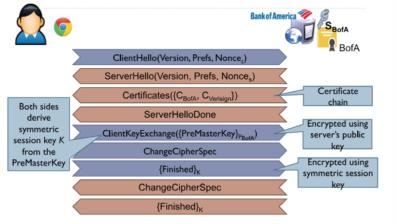

*Messaggio Hello:*
- *ClientHello:* il client invia al server il protocollo TLS supportato, la versione di TLS, i cipher suites supportati, i metodi di compressione supportati, il session ID
- *ServerHello:* il server risponde con gli stessi
- il client può richiedere di utilizzare una sessione cached

Tipi di scambio di chiave:
- RSA
- Fixed DH
- Epheral DH
- Anonymous DH

**Authentication Protocol:**
- verifica le identità dei partecipanti
- l'autenticazione del client è opzionale
- il certificato è usato per associare identità a chiavi pubbliche

**Change Cipher Spec Protocol:**
- completa il setup della connessione
- notifica al peer che i parametri di criptaggio sono stati cambiati
- il client invia un messaggio utilizzando il nuovo algoritmo di criptaggio verificano che l'Handshake è andata a buon fine

**Certificati:**
Il certificato si può ottenere:
- generandolo con openssl
- pagando un CA(Certificate Authority) per generarlo

**Certificate Authority(CA):**
Per diventare un CA:
- crea un certificato firmato da te
- vendilo ai maggiori browsers
- tieni la tua chiave privata segreta

Un CA deve assicurarsi che se qualcuno compra un certificato per un sito per esmepio, poi controlli il sito.

**Certificate Authentication:**
- durante l'Handshake il server invia il certificato al client, insieme ai certificati dei CA
- il client verifica il certificato del server

*Differenze tra DV e EV:*
- *Domain Validation(DV):* verifica che il richiedente controlli il dominio
- *Extended Validation(EV):* verifica che il richiedente controlli il dominio e che sia un'azienda legale

**Let's Encrypt:**
Servizio di certificati gratuiti, che include stakeholders da accademie e industrie.
Dura 90 giorni, ma può essere rinnovato automaticamente.

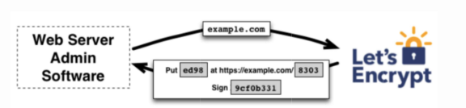

#### Problemi con TLS
- CA non è sempre affidabile:
    - il CA è un third-party fidato, se per sbaglio firma un certificato per un dominio per un principio maligno, allora il principio maligno può impersonare il dominio. Dobbiamo fidarci anche dei CA intermedi.
    - la chiave segreta CA deve essere protetta(altrimenti si potrebbero firmare certificati)
    - le firme devono solo avvenire dopo la verifica dell'identità del richiedente(DV e EV)
    - esempi di fallimenti: Comodo, DigiNotar, Trustwave
- deboli cifraggi e chiavi
    - TLS permette l'utilizzo di diversi cifraggi
    - bisogna sommare le debolezze conosciute di RC4 e MD5
    - ci sono molte chiavi ripetute per colpa della poca entropia
    - delle chiavi TLS default vengono spesso usate in devices network
- attacchi ai protocolli
    - renegotiation attack: permette ad un attaccante di rinegoziare una connessione e inserire dati malevoli. Sistemata richiedendo una verifica degli Handshakes passati
    - version downgrade attack: si può modificare la cipher suite list che il client invia al server durante l'Handshake, quindi il cifraggio diventa insicuro
    - Padding Oracle on Downgraded Legacy Encryption(Poodle): attacco che sfrutta la vulnerabilità di SSL 3.0 di forzare connessioni TLS.
- Man-in-the-middle attacchi
    - se $C_e$ è autofirmato, ci sarà un warning
    - se l'attacker ruba $C_{BofA}$ e $S_{BofA}$, allora può impersonare il sito
    - se l'attacker compra un valido $Bofa$ da un CA, allora l'unica difesa è il certificate pinning
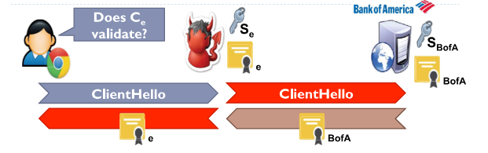
    - certificate pinning: il browser include certificati da siti famosi nel Truster Key Store
- chiavi segrete compromesse
    - se un attaccante ruba la chiave segreta, può fare da Man-in-the-middle o decifrare i dati
    - cambiando chiave non si risolve il problema perchè quella vecchia funziona ancora
    - certificate expiration: si aspetta che il certificato scada, così la chiave non è più valida. Normalmente hanno un lifetime da 1 settimana a 1 anno
    - Perfect Forward Secrecy(PFS): la chiave di sessione è generata ogni sessione, quindi se una chiave è compromessa, non lo sono le altre
    - Certificate Revocation: quando una chiave è compromessa, il CA può revocarla. CA devono avere un database dei certificati revocati da mostrare al client. Due protocolli di revoca:
        - *Certificate Revocation Lists(CRLs):* lista di certificati revocati, però ha problemi di scalabilità e un Man-in-the-middle può bloccare la lista. Il cliente visita la lista cercando i certificati. Una soluzione è avere una cache dei CRLs.
        - *Online Certificate Status Protocol(OCSP):* il client invia una richiesta al CA per sapere se il certificato è valido(non deve più così scaricare la lista intera di CRL). Il CA risponde con una risposta firmata contenente della data di scadenza del certificato. 
        - *OCSP Stapling:* il presentatore del certificato appende una risposta OCSP time-stamped firmata al certificato. Il client può verificare la risposta OCSP senza dover contattare il CA.
        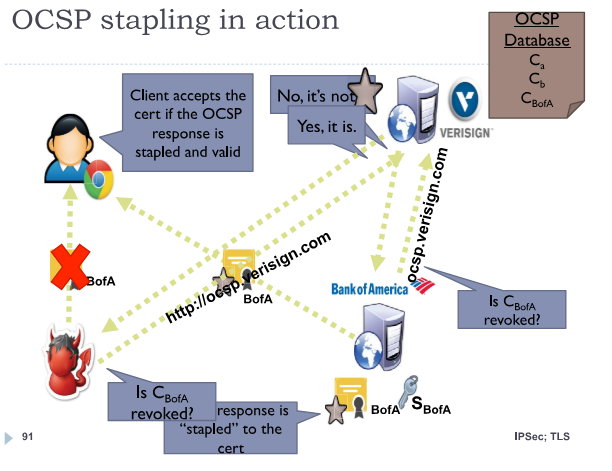
    - in pratica la revoca ha tanti problemi e funziona poco, per presenza di MitM, problemi di scalabilità, privacy, performance
- bug di implementazione
    - la crittografia si assume sia giusta
    - due fallimenti moderni:
        - apple's double fail
        - heartbleed: le chiavi segrete possono essere rubate da tutti i server vulnerabili a Hertbleed. Il server invia un pacchetto di heartbeat, il client risponde con un pacchetto di heartbeat con la stessa lunghezza del pacchetto di heartbeat. Se il client risponde con un pacchetto più lungo, allora il server invia un pacchetto di heartbeat con la lunghezza del pacchetto di heartbeat del client. Il server non controlla se il pacchetto di heartbeat è più lungo del pacchetto di heartbeat del client, quindi il server invia i dati della memoria.
        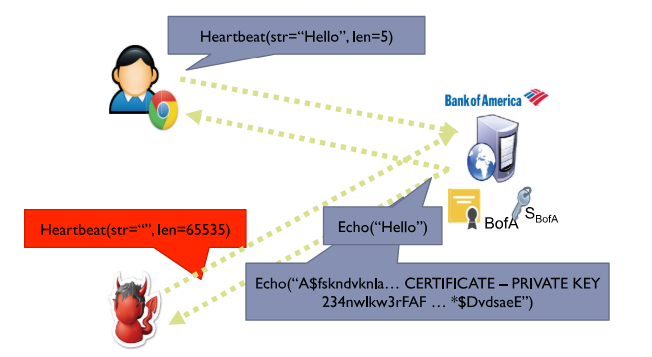

