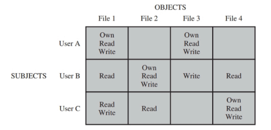
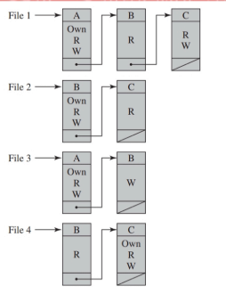

## Cybersecurity: Access Control
### Access Control
Notazione:
- $S$: soggetto
- $O$: oggetto
- $D$: dominio di protezione
- $\alpha$: permesso

**Protection Domains:**
Un insieme di oggetti e un insieme di operazioni che possono essere eseguite su quegli oggetti($\langle O, \alpha \rangle$).
I soggetti sono associati a protection domains in cui operano.
L'associazione può essere statica o dinamica.

*Esempio:*
Kernel mode e user mode sono due protection domains. L'associaizone è dinamica, in quanto un processo può passare da user mode a kernel mode, per esempio con una system call.

**Access Control Matrix:**
Un modello per *DAC*: è una matrice $M$ in cui le righe sono i domini di protezione e le colonne sono gli oggetti.
Ogni cella $M(i, j)$ contiene l'insieme di permessi $\alpha$ che il dominio $D_i$ ha sull'oggetto $O_j$.
Quando un nuovo oggetto viene creato, viene aggiunta una nuova colonna alla matrice.

Come operazione aggiuntiva esiste anche "switch domain", che permette di cambiare il dominio di protezione e copia i permessi del dominio precedente.

Difficile da mantenere poichè in un sistema dinamico, la matrice cambia spesso.

**Access Control List:**
Ogni oggetto ha una lista di controllo degli accessi associata, che contiene le coppie $\langle D, \alpha \rangle$.

I domini di gruppo vengono ragguppati in gruppi, in modo da avere una lista di controllo degli accessi più compatta e si tolgono i domini con accessi default.

Unix ha solo 3 domini di protezione: owner, group, others.

**Capabilities:**
Ogni dominio di protezione ha una lista di capabilities, che rappresentano i permessi che il dominio ha su un oggetto($\langle O, \alpha \rangle$).
Le capabilities sono associate ai processi e non agli oggetti.

I processi non devono essere in grado di creare capabilities arbitrariamente, ma possono essere copiate e trasferite ad un altro processo. L'oggetto riconosce se la capability è autentica o no. 

Le capabilities possono venire implementate utilizzando chiavi crittografiche, i processi possono mantenere e osservare le capabilities, ma non possono modificarle non potendole firmare.

Quando un processo deve accedere ad un oggetto, presenta la capability all'oggetto, che verifica la firma, il nome, il codice di controllo e il permesso richiesto.

**Revoca di permessi di accesso:**
Può essere:
- immediata o ritardata
- selettiva o generale
- permanente o temporanea
- parziale o totale

*Revoca di permessi in ACL:*
Semplicemente si aggiornano i permessi nella lista associata all'oggetto.

*Revoca di permessi in Capabilities:*
E' lungo da fare perchè bisogna controllare tutte le capabilities associate ai processi.
Le capabilities possono essere time-limited, quindi dopo una data scadenza devono essere rinnovate.
Le indirect capabilities sono capabilities che puntano a tabelle intermedie e non direttamente agli oggetti, possiamo simulare una revoce modificando la tabella intermedia.

### Unix
In Unix tutto è un file. Ogni file ha un UID e un GID associato, che sono usati per determinare i permessi di accesso, che sono 9 bit: 
- read
- write
- execute

Possono essere cambiati con *chmod* e *chown*.

*Esempio:*
- rwxr-xr--(755): il proprietario ha tutti i permessi, il gruppo ha permessi di lettura e scrittura, gli altri hanno solo permessi di lettura.

Ogni processo creato eredita i permessi del processo padre come "real user ID" e "real group ID", possono poi essere cambiati con "effective user ID" e "effective group ID" usando la system call *setuid*. Gli ID effettivi sono usati per determinare i permessi di accesso.

Il nome del proprietario e del gruppo sono memorizzati in /etc/passwd e /etc/group e possono essere cambiati con *chown* e *chgrp*.

Spesso i sistemi Unix usano un sistema misto di ACL e capabilities:
- controlli di accesso basati su ID - ACL
- revoca di permessi - ACL
- efficienza di accesso - capabilities

La system call *open* restituisce un file descriptor, che è un indice nella tabella dei file aperti del processo(File Descriptor Table). Il kernel controlla le capabilities del processo e decide se permettere o meno l'accesso.

La File Descriptor Table non è più che una lista di capabilities, che rappresentano i file a cui un processo ha accesso.
Un processo può utilizzare una capability puntandola nel file descriptor table, ma non può modificarla.

Le system call *read* e *write* usano il file descriptor per accedere al file dopo che è stato aperto senza ulteriori controlli.

Oltre a "real user ID" e "effective user ID", esiste anche "saved user ID" che contiene delle copie di "effective user ID" e "effective group ID" al tempo dell'ultimo cambio di ID. Permettono di tornare indietro ai permessi precedenti una volta terminata l'operazione di setuid.

Quando un file eseguibile viene eseguito, il "effective user ID" viene copiato in "saved user ID" e "effective user ID" viene impostato al "real user ID". 
Così ogni utente può eseguire un file eseguibile con i permessi del proprietario, poi i permessi vengono ripristinati.

Per esempio questa cosa viene fatta in Unix per il comando *passwd*, che deve essere eseguito con permessi di root per poter cambiare la password di un utente.

